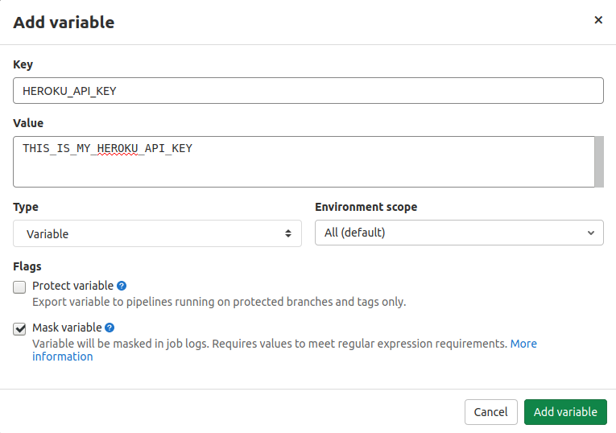

<div style="width: 600px; display: block">
    
    
</div>


# Gitlab autodeploy

This is a basic guide explaining how to configure auto-deploy in Gitlab to Heroku using Laravel and Vuejs project.

## Configuring API_KEY
Having a Heroku account with a deployed project (see how to deploy a project to heroku [here](https://github.com/LeonardoZanotti/heroku-deploy)).

First, we need the Heroku API_KEY, you can find it in `Manage Account -> Account -> API Key`. We also need the app name, you can find it by accessing Home page and then `App -> Settings -> App Name`.

Now, we gonna give access to Heroku to our project, so it can do the deploy automatically. Access the project page in Gitlab, then `Settings -> CI/CD`. Now, expand the Variables section and create the Heroku API Key:

```yml
# HEROKU_API_KEY
Key:
HEROKU_API_KEY

Value:
PAST HERE THE HEROKU API KEY
```

The options in the bottom, check the "Mask variable" option and uncheck the "Protect variable" option. Then click in Add Variable and its done.



Just do the same thing with Heroku name and all right:

```yml
# HEROKU_APP
Key:
HEROKU_APP

Value:
PAST HERE THE HEROKU APP NAME
```


# Creating a .gitlab-ci.yml file

Like a docker-compose.yml file, in .gitlab-ci.yml we also need to say which image we will use, and the structure its iqual.

Example of .gitlab-ci.yml to php:
```yml
image: php:7.3
before_script:
    - apt-get update -qq
    - apt-get install -y -qq git
    - apt-get install -y software-properties-common
    - apt-get update -qq
    - apt-get install -y libxml2-dev
    - apt-get update -qq
    - apt-get install libsodium-dev
    - apt-get update -qq
    - apt-get install -y libpng-dev
    - apt-get install -y libzip-dev
    - docker-php-ext-install pdo_mysql
    - docker-php-ext-install sodium
    - docker-php-ext-install gd
    - docker-php-ext-install zip
    - docker-php-ext-install mbstring

phpunit tests:
    stage: test
    script:
    - apt-get update
    - apt-get install curl
    - curl -s https://getcomposer.org/installer | php
    - mv composer.phar /usr/local/bin/composer
    - composer install
    - cp .env.example .env
    - php artisan key:generate
    - vendor/bin/phpunit tests
    only:
        - develop

deploy to heroku:
    stage: deploy
    script:
    - apt-get update -qq
    - apt-get install -y -qq git
    - apt-get install -y ruby
    - gem install dpl
    - dpl --provider=heroku --app=$HEROKU_APP --api-key=$HEROKU_API_KEY
    only:
        - develop
```

The description of each label of the php yml:
- image: Base image of the file. We are using php7.3 image as base for our laravel project.
- before_script: Things to be executed before the phases. How we are doing php unit tests its necessary to finish the php configuration before the tests are runned.
- phpunit tests: PHP tests to be runned. We are defining the methods and files to be tested here, in this case, we are using `vendor/bin/phpunit tests`.
- deploy to heroku: Here we use the variables we created in Gitlab to deploy the project to Heroku using dpl.
- only: We can pass here the branch of deploy.
  
To Nuxtjs/Vuejs:
```yml
stages:
    - build
    - deploy

build:
    stage: build
    image: node:13
    script:
    - npm install --progress=false
    - npm run build

deploy to heroku:
    stage: deploy
    image: "ruby:2.5"
    script:
    # install dpl:
    - apt-get update -qy
    - apt-get install rubygems ruby-dev -y
    - gem install dpl
    # deploy to heroku:
    - dpl --provider=heroku --app=$HEROKU_APP --api-key=$HEROKU_API_KEY --skip_cleanupenvironment
```

The description of each label of the Nuxtjs/Vuejs yml:
- stages: Define the stages to run. We are running two stages, build and deploy.
- build: Here we build the front, so we use image of node to use npm, then we just run `npm run build`.
- deploy to heroku: Now, we just need to deploy, so we use the ruby image, install dpl and deploy the app.

You will also edit the Procfile file, so Heroku can migrate and install passport again in every deploy automatically, just replace your file by the one in this repo or just paste this:
```
web: vendor/bin/heroku-php-apache2 public/
release: php artisan migrate:fresh --seed --force && php artisan passport:install
```

Now, just commit this to Gitlab:
```bash
$ git add .
$ git commit -m ".gitlab-ci.yml and Procfile added - Auto deploy"
$ git push
```

## Checking if success
To check if the auto deploy was right, just go to the Gitlab project page and the, in the left panel, click o CI/CD. In this page you can see the deploy process status.

## Leonardo Zanotti